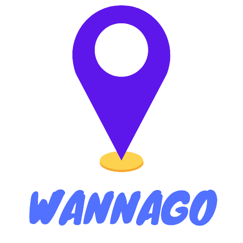

  

<!--- https://shields.io --->

___
<!--- #################### mudar badges #################### --->

https://user-images.githubusercontent.com/75763403/142768841-c07260be-947b-4f5b-83e4-038f4b0b76db.mp4

<!--- #################### mudar imagem exemplo #################### --->
___
> This site was made to pin where you wanna go!

- [x] Google Auth with Firebase.
- [x] Nookies to persist login.
- [x] Show user info and SignOut user .
- [x] Responsivity
- [x] Render Map
- [x] Pin locals and add descriptions in the local.
- [x] Save info in Firestore
- [x] Dark mode
___
## 💻 Prerequisites

- Install LTS Node version.
<!--- #################### mudar pré-requisitos  ####################--->
___
## 🛠 Tools used

- <b>Nextjs</b>
- <b>Firebase</b>
- Material UI
- Reac Google Maps API
- Nookies
- Next-pwa

<!--- #################### mudar ferramentas #################### --->
___
## 🚀 Installing wannago

To use, follow the steps:

- git clone https://github.com/rodrigorvsn/wannago.git
- yarn || npm install
- update your credentials in .env.local
- yarn dev

## 📫 Contribuiting with wannago

To contribue with wannago, follow the steps:

1. Fork this repository.
2. Create a branch: `git checkout -b <name_branch>`.
3. Make the changes and confirm: `git commit -m '<message_commit>'`
4. Send to original repository: `git push origin <main_branch> / <local>`
5. Send the pull request.

Alternatively, see the GitHub documentation at [how to create a pull request](https://help.github.com/en/github/collaborating-with-issues-and-pull-requests/creating-a-pull-request).
___
## 🤝 Contributors

Made with ❤️ by:

<table>
  <tr>
    <td align="center">
      <a href="#">
         
        
          <b>Rodrigo Victor</b>
        
      </a>
    </td>
  </tr>
</table>
